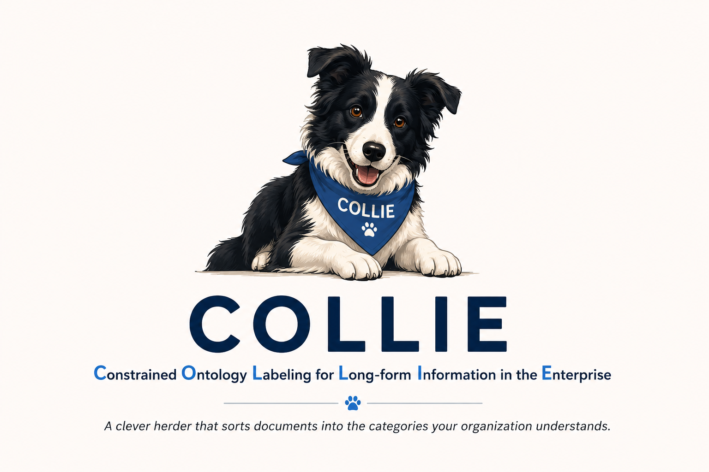

# COLLIE

<p align="center">
  
</p>

**Constrained Ontology Labeling for Long-form Information in the Enterprise**

COLLIE is a small (0.6B) model that catalogs enterprise documents: given any
text an organization produces — email, PDFs, tickets, chat, code, logs — it
identifies the topic(s) discussed and assigns descriptive tags that together
say what the document is about and how it discusses it.

COLLIE is a **librarian, not a judge**: it describes content and makes no
judgment about sensitivity or importance. A public salary survey and an
individual's comp negotiation are both `compensation` — the tags
(`aggregate/public` vs `individual/internal`) carry the distinction, and what
you do with that description is your system's business.

The catalog is a **soft anchor, not a cage**. You hand COLLIE a topic
vocabulary at prompt time (yours, ours, or none at all); it prefers your
terms when they fit and coins coherent topics when they don't — a log file
becomes `system_error_logging`, not a forced bad fit. See
[taxonomy.md](taxonomy.md) for the reference ontology it was seeded with.

## How it's built

1. **Real enterprise-register corpora, all from public sources** — 2,480
   documents sampled across six registers (tail-boosted for rare topics),
   drawn from:
   - **Enron email corpus** — the public archive of real corporate email
     released during the FERC investigation; the classic enterprise-email
     research dataset.
   - **FinePDFs** — diverse real-world PDF documents from the
     [HuggingFaceFW/finepdfs](https://huggingface.co/datasets/HuggingFaceFW/finepdfs)
     dataset on Hugging Face.
   - **Apache Foundation JIRA tickets** — public support/issue tickets
     (summary, description, comment threads) from Apache project trackers.
   - **Public Slack-style chat archives** — messages from openly published
     community Slack archives (e.g. ops/infra communities).
   - **Public GitHub code** and **LogHub system logs** — for the code and
     machine-log registers.

   No synthetic documents were used for training in the current rounds.
2. **Teacher labeling with reasoning traces** — gpt-5.4-mini (bulk) +
   gpt-5.5 (rare-topic tail) label each doc with a concise mandatory
   `<think>` trace (median 78 words) plus strict-JSON labels. A hard filter
   drops any response without genuine reasoning, unparseable JSON, or
   off-ontology labels → 2,096 clean examples.
3. **Controlled distillation experiments** — Qwen3-0.6B fine-tuned in
   matched pairs (reason-first vs direct, structured vs flat output) on
   identical data and eval splits, so every score gap is attributable.

## Why the datasets are not in this repo

The source documents come from third-party corpora and public archives whose
licenses and terms vary — **I don't have the right to redistribute them, so
neither the sampled documents nor the teacher-labeled training sets are
included here.** What ships is everything needed to rebuild them:

- the ontology ([taxonomy.md](taxonomy.md)) — the labeling contract,
- the sampling, teacher-labeling, filtering, and SFT-assembly code
  (`data_prep/`), and
- the exact teacher prompts inside those scripts.

To build your own catalog: point `data_prep/sample_2k.py` at corpora you have
rights to — Hugging Face hosts many suitable public datasets (email, PDFs,
tickets, chat, code, logs) — or use an LLM to generate augmented or fully
synthetic enterprise-register documents and label them with the same pipeline.
The pipeline is corpus-agnostic: anything that yields `{id, text}` records
works.

## Results so far

**Rounds 1–3 — closed-ontology phase** (210-doc held-out eval, exact match):

| variant | topic F1 | topic P | topic R | correct-abstain /25 |
|:--|:--:|:--:|:--:|:--:|
| structured reason | 0.618 | 0.620 | 0.616 | 7 |
| structured direct | 0.608 | 0.673 | 0.554 | 0 |
| flat reason | 0.612 | 0.589 | 0.638 | 9 |
| **flat direct** | **0.655** | 0.651 | 0.659 | 0 |
| flat direct + 3× none-boost | 0.615 | 0.680 | 0.560 | 12 |

- **Output shape matters more than reasoning.** Dropping per-topic facet
  binding (flat `{"topics":[...],"tags":[...]}`) bought the direct model
  ~5 F1 points — the nested format was taxing topic identification itself.
- **Abstention is a data prior, not a capability.** Direct models never
  abstained (0/25) until the training share of empty-label docs was boosted
  8.5%→22%, after which they abstained fine (12/25) — but over-eagerly,
  costing recall. With an open vocabulary the "none" class dissolves anyway
  (log files become `system_error_logging`, not "no topic").

**Rounds 4–5 — open-vocabulary, anchor-conditioned** (LLM-judge semantic
scoring; two OOD axes: registers never trained on — JIRA tickets, system
logs — and anchor vocabularies never trained on — education, government,
energy, media, biotech catalogs). Round 5: 4,414 training docs, two model
sizes, prediction pre-registered before the run:

| topic F1 (judged) | in-dist | register-OOD | anchor-OOD |
|:--|:--:|:--:|:--:|
| reason 0.6B | 0.498 | 0.590 | 0.541 |
| direct 0.6B | **0.548** | 0.587 | **0.559** |
| reason 1.7B | 0.585 | 0.647 | 0.593 |
| **direct 1.7B** | **0.593** | **0.670** | **0.630** |

- The catalog became a prompt-time input: five anchor regimes in training
  (canonical / subset / paraphrase / alternative-domain / none) teach the
  model to prefer whatever catalog it is handed and coin coherent topics
  when the catalog doesn't fit. **Handed never-seen catalogs, every model
  still functions** — anchor-conditioning generalizes.
- **The pre-registered prediction failed.** Round 4 had hinted reasoning
  transfers better out-of-distribution; at 3× data the effect vanished, and
  at 1.7B direct wins every cell — by the most on the hardest axis. A
  distilled trace appears to act as a regularizer for an undertrained
  model, not as a transferable procedure.
- **The shipping recipe: direct fine-tune, open vocabulary, varied
  anchors.** 0.6B for throughput, 1.7B for quality.

The full arc — including the failed hypothesis — is written up in
[journal/2026-07-24-five-rounds.md](journal/2026-07-24-five-rounds.md).

## Layout

```
taxonomy.md       the ontology (topics + facets) — the contract
data_prep/        corpus sampling, teacher labeling (OpenAI batch + OpenRouter), SFT assembly
train/            0.6B SFT + eval-generation scripts (run on a rented GPU)
eval/             scorers: structured (topic F1 + per-facet acc) and flat (topics/tags F1)
data/             NOT distributed (see above) — rebuilt locally by data_prep/
results/          model predictions per experiment (label ids only, no document text)
journal/          findings, written as they happened
```

## Status

Five experimental rounds complete; the recipe is settled (direct fine-tune,
open vocabulary, varied anchors). Trained models: `collie-r5-direct-0.6b`
and `collie-r5-direct-1.7b` (plus the reason variants for the record).
